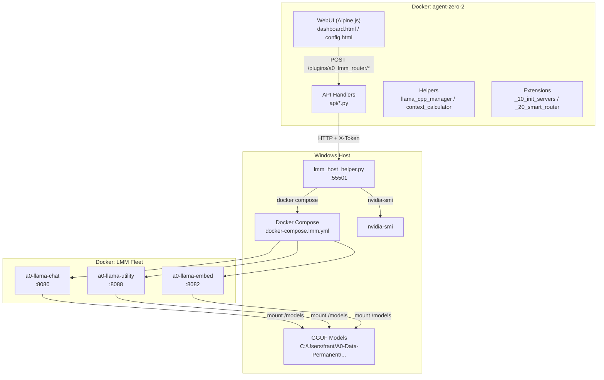

# LMM Router GUI — Improvement Plan (Inspired by lmstudio-js)

> **Status**: Planning only — no code changes yet  
> **Date**: 2026-05-14  
> **lmstudio-js License**: MIT (Element Labs Inc, 2025) — free to use/adapt  
> **lmstudio-js Source**: `github.com/lmstudio-ai/lmstudio-js` → `packages/`  

---

## 1. Current System Analysis

### Architecture Summary



### Identified Problems

| # | Problem | Root Cause |
|---|---------|-----------|
| **P1** | Models show in "Installed" list but can't be loaded to containers | `_handle_assign_model` writes env + `docker compose up -d <service>` but the compose file uses `${CHAT_MODEL_PATH}` which points to a **container-internal** path (`/models/...`), while the host helper resolves to a **host** path. Path mismatch. |
| **P2** | Context window not auto-fitted to available VRAM | `context_calculator.py` exists but is **never called** from `_handle_assign_model` in `lmm_host_helper.py`. The host helper just writes the model path but doesn't recalculate `*_CTX_SIZE`. |
| **P3** | No visual feedback for VRAM budget during model assignment | Dashboard shows VRAM usage but doesn't preview "what happens if I load this model here?" |
| **P4** | No one-click "load model → start container" flow | User must: select model → assign → wait → separately click Load. These should be unified. |

---

## 2. LM Studio Features Worth Adopting

### Feature Mapping (lmstudio-js → a0_lmm_router)

| LM Studio Feature | SDK Path | License | Our Equivalent | Gap |
|---|---|---|---|---|
| **`.model("key")` — JIT load** | `packages/lms-client/src/llm/LLMNamespace.ts` | MIT | `assign_model` + `controlSlot(start)` | Two-step; should be one call |
| **`.load()` with config** | `packages/lms-client/src/llm/LLMNamespace.ts` | MIT | `docker-compose.lmm.env` vars | No GUI for load-time params |
| **`contextLength` param** | `LLMLoadModelConfig.contextLength` | MIT | `context_calculator.py` | Calculator exists, never wired |
| **`gpu.ratio`** | `LLMLoadModelConfig.gpu` | MIT | `*_GPU_LAYERS` env var | No slider in GUI |
| **`getContextLength()`** | `packages/lms-client/src/llm/LLMDynamic.ts` | MIT | llama.cpp `/props` endpoint | Not surfaced in dashboard |
| **`model.unload()`** | `packages/lms-client/src/llm/LLMDynamic.ts` | MIT | `controlSlot('stop')` | Works but no VRAM preview |
| **TTL auto-unload** | `LLMLoadModelConfig.ttl` | MIT | None | **Missing entirely** |
| **Speculative decoding** | `packages/lms-client/src/llm/LLMNamespace.ts` | MIT | None | Future — needs draft model |
| **KV cache quantization** | `LLMLoadModelConfig.llamaKCacheQuantizationType` | MIT | `*_CACHE_TYPE_K/V` env vars | In env but no GUI control |
| **Flash Attention toggle** | `LLMLoadModelConfig.flashAttention` | MIT | `*_FLASH_ATTN` env var | In env but no GUI toggle |
| **List downloaded models** | `packages/lms-client/src/system/SystemNamespace.ts` | MIT | `/models/list` host helper | Works but no GGUF metadata display |
| **Model info (params, quant)** | `packages/lms-client/src/llm/LLMDynamic.ts` | MIT | `read_gguf_metadata()` | Exists but not shown in GUI |

---

## 3. Improvement Ideas

### 🔴 Critical (Fix Broken Flows)

#### 3.1 — Fix Model-to-Container Loading Pipeline
**Problem**: P1 — path mismatch between host and container  
**Backend**:
- In `lmm_host_helper.py::_write_env_for_slot()`, convert the resolved host path to a container-internal `/models/...` path using the known mount mapping
- Add validation: before writing env, check that the GGUF file actually exists at the resolved path
- Add a `--models-mount-target` arg to the host helper (default `/models`) for the path translation

**Frontend**:
- Show clear error toast when assignment fails with the actual stderr from docker compose
- Add a "Diagnose" button per slot that checks: env file content → container mount → file exists inside container

#### 3.2 — Wire Context Calculator into Assignment Flow
**Problem**: P2 — `context_calculator.py` exists but never called  
**Backend**:
- In `lmm_host_helper.py::_handle_assign_model()`, after resolving the model path:
  1. Call `read_gguf_metadata(model_path)` to get `n_ctx_train`, `n_layer`, `n_embd`
  2. Query `/gpu-stats` for current VRAM
  3. Calculate other_slots_vram from running containers
  4. Call `calculate_optimal_context(path, slot, available_vram, other_slots_vram)`
  5. Write the calculated `*_CTX_SIZE` to the env file alongside `*_MODEL_PATH`
- Return the context calculation reasoning in the API response

**Frontend**:
- After assignment succeeds, show a toast: "Loaded with 65536 context (VRAM allows 65K, model supports 262K)"

> [!IMPORTANT]
> This is the **#1 feature request** — LM Studio does this automatically via `LLMLoadModelConfig.contextLength` + internal VRAM budget. We have the calculator code (`context_calculator.py`), we just need to wire it in.

---

### 🟡 High Priority (LM Studio-Inspired GUI Components)

#### 3.3 — VRAM Budget Visualizer (inspired by LM Studio's GPU offload UI)
**Source**: LM Studio GUI (not in SDK — internal to Electron app)  
**License**: N/A (UI concept, not code)

**Frontend component**: `VRAMBudgetBar`
```
┌─────────────────────────────────────────────────┐
│ RTX 4090 — 24 GB VRAM                           │
│ ██████████████░░░░░░░░░░░░░░░░░░░░  17.5 / 24 GB│
│ ├─ chat weights ████████  5.7 GB                 │
│ ├─ chat KV@64K  ██████████  9.0 GB               │
│ ├─ utility wts  █████  5.7 GB (shared file)      │
│ ├─ util KV@16K  ███  2.3 GB                      │
│ ├─ embed        █  0.5 GB                        │
│ └─ free         ░░░░░░  6.5 GB                   │
└─────────────────────────────────────────────────┘
```

- Stacked horizontal bar with color-coded segments per slot
- **Preview mode**: when user selects a model from dropdown, show a ghost overlay of what VRAM would look like
- Warning badge when projected usage > 90%
- Data source: existing `/lmm_compute_stats` + GGUF metadata from `/models/list`

#### 3.4 — Unified Load/Assign Panel (inspired by `client.llm.load()`)
**Source**: `lmstudio-js/packages/lms-client/src/llm/LLMNamespace.ts` → `load()` method  
**License**: MIT

Replace the current two-step assign+load with a single **"Load Model"** panel per slot:

```
┌─ Chat Slot ──────────────────────────────────────┐
│ ● Healthy — Qwen3.5-9B-Q4_K_M — :8080           │
│                                                   │
│ Model:  [▼ Qwen3.5-9B-Q4_K_M     ]  [🔄 Load]  │
│                                                   │
│ Context: [═══════════●════] 65536 tokens          │
│          min 16384        max 262144 (model)      │
│          ↳ auto-fitted: 65K (18GB free VRAM)      │
│                                                   │
│ GPU Layers: [═══════════════●] 999 (all)          │
│ KV Quant:   [f16 ▼]  Flash Attn: [✓]             │
│                                                   │
│ [Unload] [Apply Changes]                          │
└──────────────────────────────────────────────────┘
```

**Backend**: New `/models/load` endpoint that combines assign + calculate context + restart container in one call

#### 3.5 — Model Card with GGUF Metadata (inspired by `model.getModelInfo()`)
**Source**: `lmstudio-js/packages/lms-client/src/llm/LLMDynamic.ts` → `getModelInfo()`  
**License**: MIT

For each installed model, show a card with:
- **Name**, quantization, file size
- **Architecture**: params, layers, embedding dim (from GGUF)
- **Max context** (`n_ctx_train`) — critical for users
- **Estimated VRAM**: weights + KV at various context sizes
- **Assigned slot** badge (or "unassigned")
- **Compatibility**: which slots this model fits in (based on VRAM budget)

Data source: extend `/models/list` host helper endpoint to include GGUF metadata per model (call `read_gguf_metadata` on the host side where files are accessible).

#### 3.6 — Context Window Slider with Live VRAM Preview
**Source**: `LLMLoadModelConfig.contextLength` from lmstudio-js  
**License**: MIT

- Range slider: `min_ctx_for_role` → `n_ctx_train` (from GGUF)
- Live calculation below: "KV cache at {ctx}: {X} GB → total slot VRAM: {Y} GB"
- Color changes: green (comfortable) → yellow (tight) → red (won't fit)
- "Auto" button that runs `calculate_optimal_context()` and snaps the slider

---

### 🟢 Medium Priority (Quality of Life)

#### 3.7 — TTL Auto-Unload (inspired by `LLMLoadModelConfig.ttl`)
**Source**: `lmstudio-js/packages/lms-client/src/llm/LLMNamespace.ts`  
**License**: MIT

- Add idle timer per slot: if no request in N minutes, auto-unload to free VRAM
- GUI: "Auto-unload after [▼ 30 min] idle" per slot
- Backend: Track last request timestamp per slot in `stats_tracker.py`; add a periodic check in the agent_init extension

#### 3.8 — Model Search & Download from HuggingFace (enhanced)
**Current**: Manual repo_id + filename entry  
**Improvement**:
- Add HuggingFace API search: type model name → see matching GGUF repos
- Show quant variants with file sizes
- One-click install with pre-filled role based on model name
- VRAM fit indicator next to each variant ("fits ✓" / "tight ⚠" / "won't fit ✗")

#### 3.9 — Slot Health Timeline
- Mini sparkline per slot showing health over last 24h
- Downtime windows highlighted in red
- Correlate with GPU temperature/utilization spikes

#### 3.10 — Docker Container Log Viewer
- Inline expandable log tail per slot (last 50 lines)
- Auto-scroll, error highlighting
- Useful for debugging model load failures

#### 3.11 — Multi-Model VRAM Planner ("What If" Mode)
- Table view: pick models for each slot → see total VRAM projection
- Drag-and-drop models between slots
- "Can I run all three simultaneously?" answer with breakdown

#### 3.12 — Preset Templates (inspired by `_model_config/presets.yaml`)
- Pre-built slot configurations: "Balanced", "Max Context", "Max Quality"
- One-click apply: sets all three slots + context sizes + KV quant
- Custom presets: save current config as named preset

---

### 🔵 Lower Priority (Future / Nice to Have)

#### 3.13 — Speculative Decoding Support
**Source**: `lmstudio-js/packages/lms-client/src/llm/LLMNamespace.ts` → speculative decoding config  
**License**: MIT  
- Add draft model selection per slot
- llama.cpp supports `--draft` flag — add to compose command
- GUI: "Draft model: [▼ select small model]" under each slot

#### 3.14 — Real-time Token/s Metrics
- Show live tokens/second during inference
- Historical chart: throughput over time per slot
- Helps users understand model speed tradeoffs

#### 3.15 — Model Comparison View
- Side-by-side: pick two models, show benchmark scores, VRAM, speed
- "Try both" button: send same prompt to two slots, compare outputs

#### 3.16 — GPU Offload Ratio Slider (inspired by `LLMLoadModelConfig.gpu.ratio`)
**Source**: `LLMLoadModelConfig.gpu` from lmstudio-js  
**License**: MIT  
- Slider: 0% (CPU only) → 100% (full GPU)
- Translates to `--n-gpu-layers` value
- Live VRAM preview updates as slider moves

#### 3.17 — Batch Processing Queue
- Queue multiple prompts for a slot
- Progress bar with estimated time
- Useful for wiki ingestion workflows

#### 3.18 — Model Update Checker
- Check HuggingFace for newer quants of currently installed models
- "Update available" badge on model cards
- One-click re-download

---

## 4. Priority Implementation Order

```mermaid
gantt
    title Implementation Priority
    dateFormat X
    axisFormat %s

    section Critical Fixes
    Fix path mismatch (3.1)        :crit, 0, 2
    Wire context calculator (3.2)  :crit, 0, 2

    section High Priority
    VRAM Budget Visualizer (3.3)   :active, 2, 4
    Unified Load Panel (3.4)       :active, 3, 5
    Model Cards + metadata (3.5)   :4, 5
    Context Slider (3.6)           :4, 6

    section Medium Priority
    TTL auto-unload (3.7)          :6, 7
    HF search enhanced (3.8)       :6, 8
    Health timeline (3.9)          :7, 8
    Log viewer (3.10)              :7, 8
    VRAM planner (3.11)            :8, 9
    Preset templates (3.12)        :8, 9
```



---

## 5. Technical Notes

### Context Auto-Sizing — How LM Studio Does It vs How We Should

**LM Studio** (from SDK docs):
```typescript
const model = await client.llm.load("qwen2.5-7b-instruct", {
  config: {
    contextLength: 8192,     // explicit
    gpu: { ratio: 0.5 },     // GPU offload
    flashAttention: true,
    llamaKCacheQuantizationType: "q4_0",
  },
});
```
LM Studio reads the model's metadata, checks available VRAM, and if `contextLength` is not specified, automatically picks the largest context that fits. The user can override.

**Our system** should:
1. Read GGUF metadata on the host (where files are accessible)
2. Query live VRAM via nvidia-smi  
3. Calculate optimal context using existing `context_calculator.py`
4. Write to env file and restart container
5. Surface the reasoning in the GUI

### Key Files to Modify

| File | Changes |
|---|---|
| `tools/lmm_host_helper.py` | Fix path translation in `_write_env_for_slot`, add context auto-calculation, add `/models/load` combined endpoint |
| `helpers/context_calculator.py` | Import into host helper (or extract to shared module), add VRAM query integration |
| `webui/dashboard.html` | Add VRAM budget bar, unified load panel, model cards, context slider |
| `webui/js/dashboard-store.js` | Add VRAM preview calculations, model metadata fetch, combined load action |
| `api/assign_model.py` | Wire context calculation into assignment response |
| `docker/docker-compose.lmm.env` | Auto-update `*_CTX_SIZE` on assignment |

---

## 6. Design Language

All new components should follow the existing **Catppuccin Mocha** design system already in `dashboard.html`:

| Token | Value | Usage |
|---|---|---|
| `--ok` | `#a6e3a1` | Healthy, fits, success |
| `--warn` | `#f9e2af` | Tight, approaching limit |
| `--err` | `#f38ba8` | Won't fit, error |
| `--info` | `#89b4fa` | Informational, selected |
| `--accent` | `#cba6f7` | Primary actions, highlights |
| `--surface` | `#181825` | Card backgrounds |
| `--border` | `#313244` | Borders, separators |

Use Alpine.js for reactivity (matching existing stack). No new frameworks.
